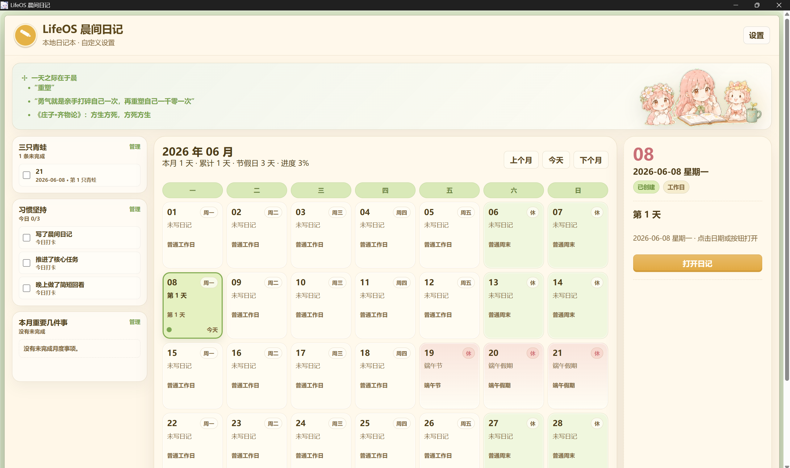
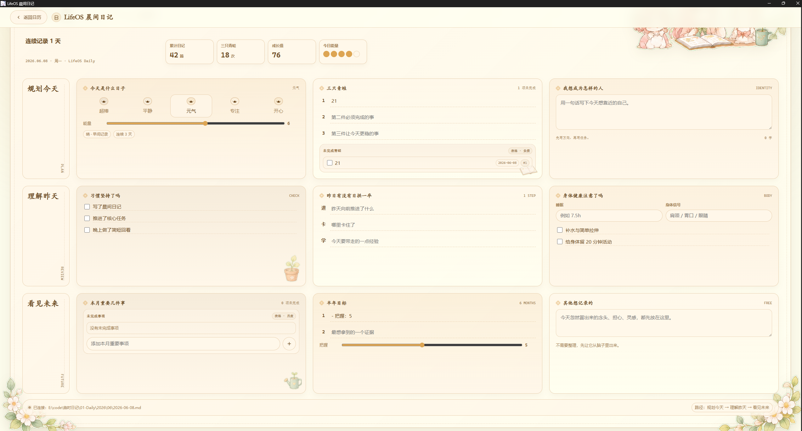
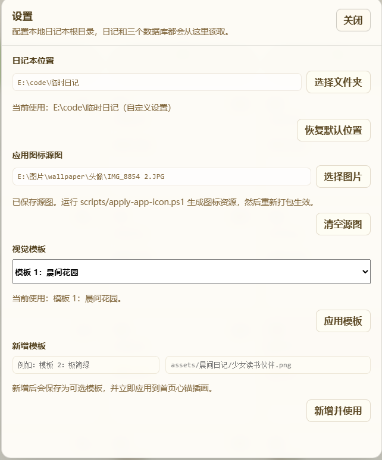

# LifeOS

LifeOS 是一个本地优先的人生管理系统。它把晨间日记、三只青蛙、习惯坚持、本月重要事项、长期领域和阶段复盘放到同一套 Markdown + CSV 工作流里，方便用桌面应用记录，也方便用 Obsidian、编辑器或 AI 工具做回顾。

当前仓库主要包含一个 Tauri v2 桌面应用：**LifeOS Morning Journal**。

> 想要一起讨论或共建，欢迎联系 Q：2407414779

## 快速开始

### 一键启动（开发）

```powershell
.\run.ps1    # Windows
```

```bash
./run.sh     # macOS / Linux
```

### 一键打包

```powershell
.\build.ps1  # Windows → dist/ 生成 .exe 安装包
```

```bash
./build.sh   # macOS → dist/ 生成 .app 和 .dmg
```

### 环境要求

#### Windows

| 工具 | 下载地址 | 安装说明 |
|------|----------|----------|
| Node.js (LTS) | https://nodejs.org/zh-cn/download | 下载 Windows 安装包，一路下一步即可 |
| Rust | https://rustup.rs/ | 下载并运行 `rustup-init.exe`，按提示完成安装 |
| Visual Studio Build Tools | https://visualstudio.microsoft.com/zh-hans/visual-cpp-build-tools/ | 安装时勾选「使用 C++ 的桌面开发」工作负载 |

#### macOS

| 工具 | 下载地址 | 安装说明 |
|------|----------|----------|
| Node.js (LTS) | https://nodejs.org/zh-cn/download | 推荐用 Homebrew：`brew install node` |
| Rust | https://rustup.rs/ | 终端执行 `curl --proto '=https' --tlsv1.2 -sSf https://sh.rustup.rs \| sh` |
| Xcode Command Line Tools | — | 终端执行 `xcode-select --install`（Tauri 编译需要） |

安装完成后重启终端，验证环境：

```bash
node --version
rustc --version
```

## 适合用来做什么

- 每天写晨间日记，启动当天状态、重点事项和自由记录。
- 用「三只青蛙」维护跨日期的待办和历史负债。
- 用「习惯坚持」维护习惯定义和每日打卡。
- 用「本月重要几件事」管理月度事项，并在完成后回写 CSV。
- 用 Markdown 目录记录人生领域、具体项目、复盘总结和资料索引。
- 把真实数据保存在本地，避免依赖云服务或第三方账号。

## 当前功能

- 日历首页：按日期进入当天晨间日记，并查看当月已创建记录。
- 九宫格晨间日记：填写状态、三件重点、习惯复盘、月度事项和其他记录。
- 数据库预览：在首页查看未完成青蛙、习惯、本月重要事项。
- 数据库管理页：分别维护任务、习惯和月度事项。
- 本地自动保存：日记保存为 Markdown，结构化数据保存为 CSV。
- 多套 UI 主题：内置清爽、晨光、工作台、二次元等视觉风格。
- Vault 切换：可以通过设置或环境变量切换本地日记本目录。

## 应用截图

### 日历首页



### 晨间日记



### 设置



## 项目结构

```text
.
├── desktop/          # Tauri v2 桌面应用
├── scripts/          # 辅助脚本（图标生成、版本升级等）
├── dist/             # 构建产物（安装包，自动生成）
├── build.ps1 / build.sh     # 一键打包脚本（Windows / macOS）
├── run.ps1 / run.sh         # 一键启动脚本（Windows / macOS）
├── 人生管理记录/     # 可复制使用的 Markdown 人生管理模板
├── 应用截图/         # README 中展示的应用界面截图
├── LICENSE
└── README.md
```

## 技术栈

- Tauri v2
- Rust
- HTML / CSS / JavaScript
- Markdown + CSV 本地数据


## 数据目录

默认数据目录：

- 开发模式：仓库根目录下的 `LifeOS-Vault/`
- 打包应用：系统应用数据目录下的 `LifeOS-Vault/`

可以用环境变量覆盖：

```powershell
# Windows
$env:LIFEOS_VAULT_DIR="$env:USERPROFILE\Documents\LifeOS-Vault"
cd desktop
npm run tauri:dev
```

```bash
# macOS / Linux
export LIFEOS_VAULT_DIR="$HOME/Documents/LifeOS-Vault"
cd desktop
npm run tauri:dev:mac
```

Vault 结构：

```text
LifeOS-Vault/
├── 00-Databases/
│   ├── frogs.csv
│   ├── habits.csv
│   └── monthly-important.csv
└── 01-Daily/
    └── YYYY/MM/YYYY-MM-DD.md
```

## 隐私说明

LifeOS 默认只读写本地文件，不需要登录账号，也不会把日记同步到远端。仓库里的 `人生管理记录/` 是空模板目录；真实日记和 CSV 建议放在 `LifeOS-Vault/` 或其他仓库外目录。

`LifeOS-Vault/`、`.env`、日志和常见临时素材目录已经写入 `.gitignore`，避免把个人数据误提交。

## 应用图标

桌面应用图标可以在应用设置里选择，也可以用脚本生成：

```powershell
# Windows
.\scripts\apply-app-icon.ps1 -SourcePath "$env:USERPROFILE\Pictures\lifeos-icon.png"
```

```bash
# macOS
bash scripts/apply-app-icon.sh --source ~/Pictures/lifeos-icon.png
```

PNG / JPG / JPEG 会作为源图生成整套 Tauri 图标资源。生成后重新打包：

```powershell
# Windows
cd desktop
npm run tauri:build
```

```bash
# macOS
cd desktop
npm run tauri:build:mac
```

## License

本项目使用 GPL-3.0 License，详见 [LICENSE](LICENSE)。
